# AWS Centralized Traffic Inspection Architecture

## Overview

This document provides detailed architectural diagrams and explanations for the AWS centralized traffic inspection solution using Palo Alto firewalls with Gateway Load Balancer (GWLB) and Transit Gateway (TGW).

## High-Level Architecture

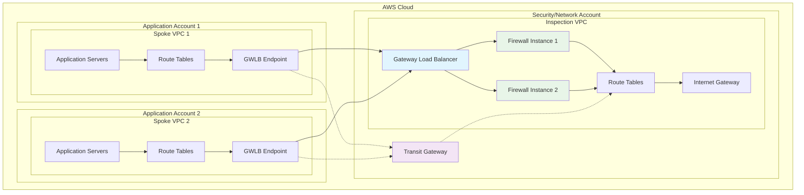

## Detailed Component Architecture

### 1. Inspection VPC Architecture

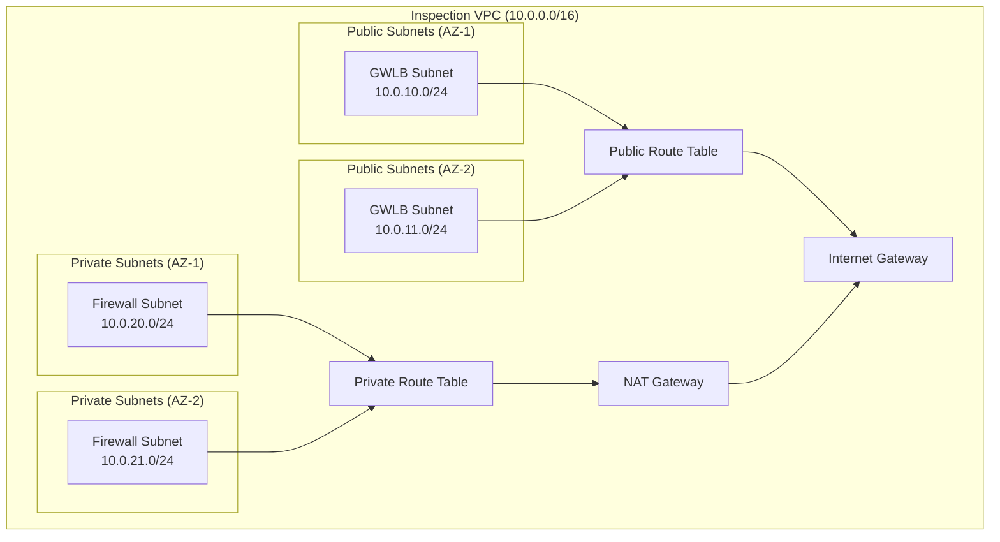

### 2. Gateway Load Balancer Architecture

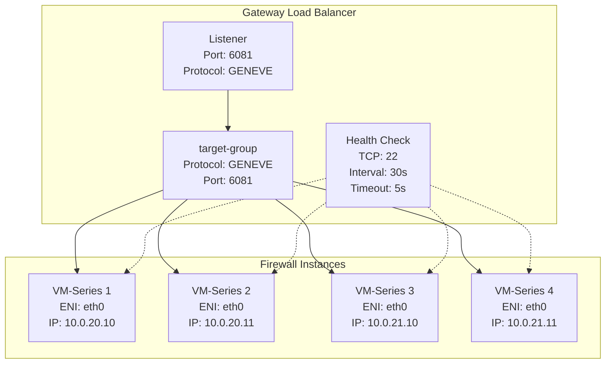

### 3. Transit Gateway Architecture

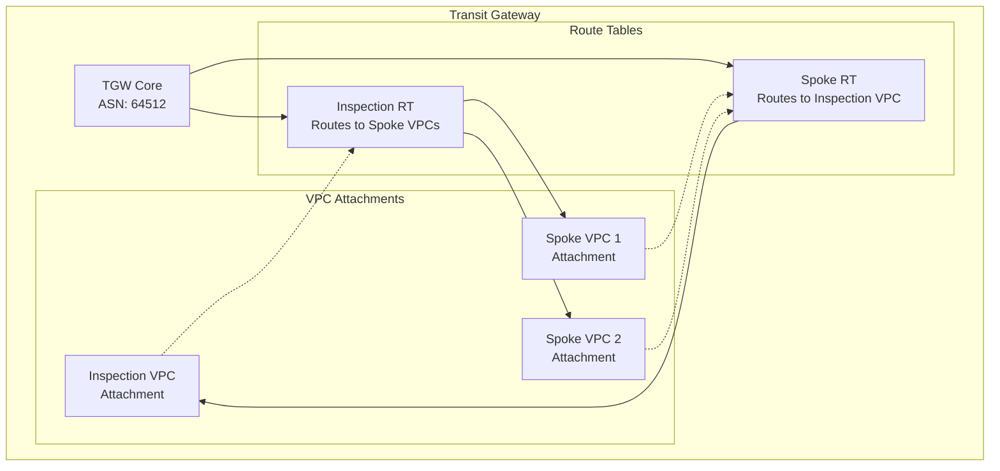

## Traffic Flow Diagrams

### North-South Traffic Flow (Internet-bound)

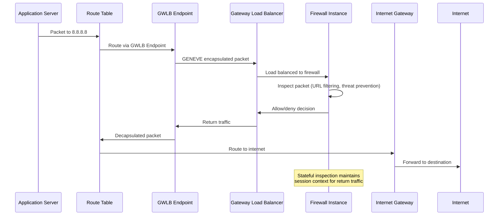

### East-West Traffic Flow (Inter-VPC)

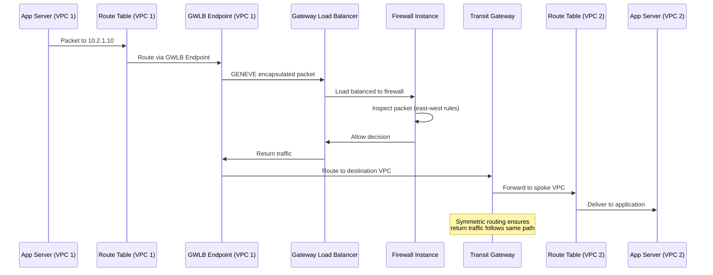

## Network Segmentation Details

### Subnet Design

```
Inspection VPC (10.0.0.0/16)
├── Public Subnets (GWLB)
│   ├── 10.0.10.0/24 (AZ-1)
│   ├── 10.0.11.0/24 (AZ-2)
│   └── 10.0.12.0/24 (AZ-3)
├── Private Subnets (Firewalls)
│   ├── 10.0.20.0/24 (AZ-1)
│   ├── 10.0.21.0/24 (AZ-2)
│   └── 10.0.22.0/24 (AZ-3)
└── Management Subnets (Optional)
    ├── 10.0.30.0/24 (AZ-1)
    ├── 10.0.31.0/24 (AZ-2)
    └── 10.0.32.0/24 (AZ-3)

Spoke VPC 1 (10.1.0.0/16)
├── Public Subnets
│   ├── 10.1.10.0/24 (AZ-1)
│   ├── 10.1.11.0/24 (AZ-2)
│   └── 10.1.12.0/24 (AZ-3)
├── Private Subnets
│   ├── 10.1.20.0/24 (AZ-1)
│   ├── 10.1.21.0/24 (AZ-2)
│   └── 10.1.22.0/24 (AZ-3)
└── Database Subnets
    ├── 10.1.30.0/24 (AZ-1)
    ├── 10.1.31.0/24 (AZ-2)
    └── 10.1.32.0/24 (AZ-3)
```

## Security Architecture

### Defense in Depth Layers

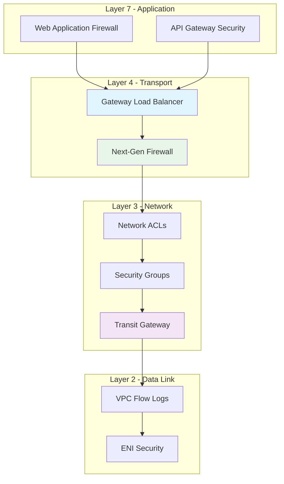

### Firewall Rule Architecture

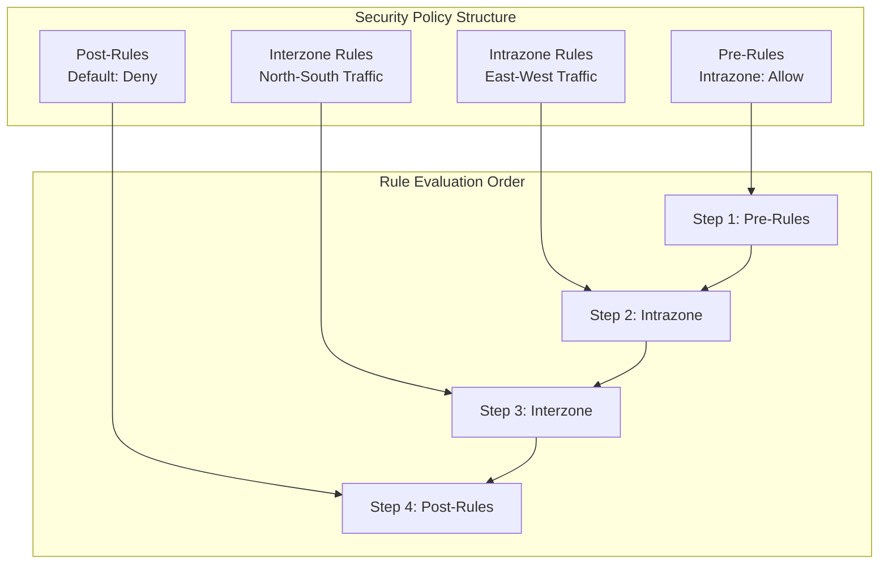

## High Availability Architecture

### Multi-AZ Deployment

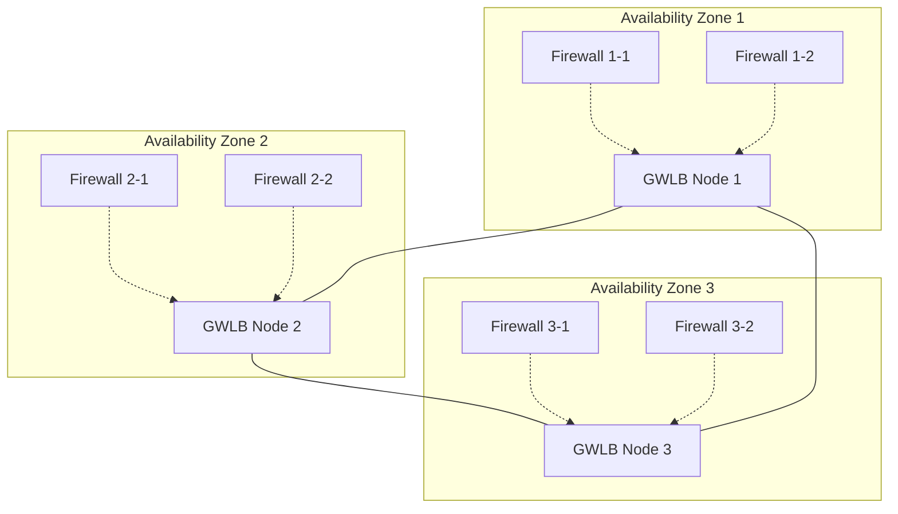

### Auto-scaling Architecture

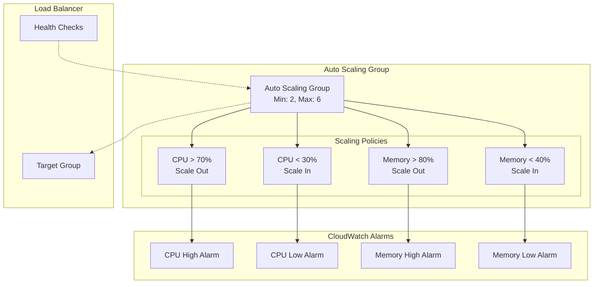

## Monitoring and Observability

### Metrics Architecture

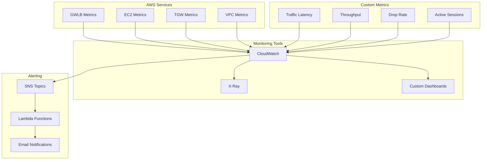

## Deployment Architecture

### Terraform Module Structure

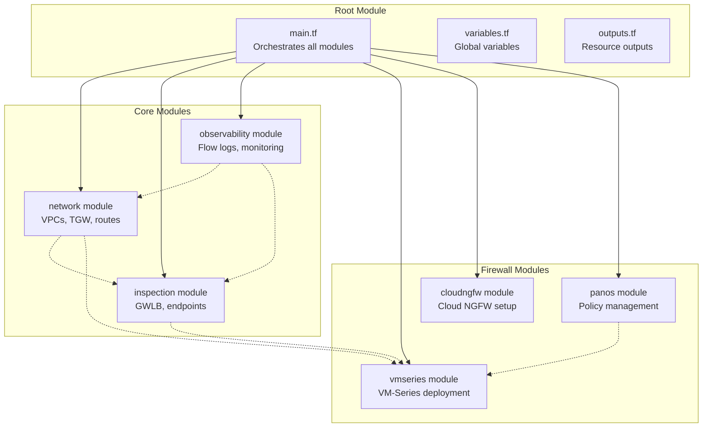

## Performance Considerations

### Throughput Optimization

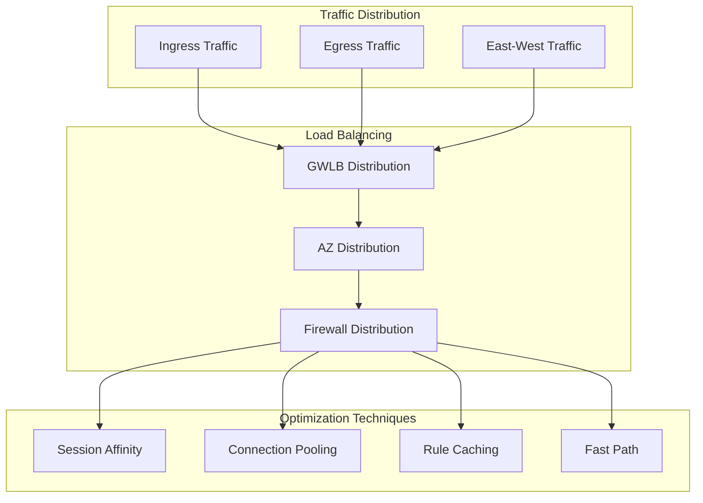

## Compliance Architecture

### Security Standards Mapping

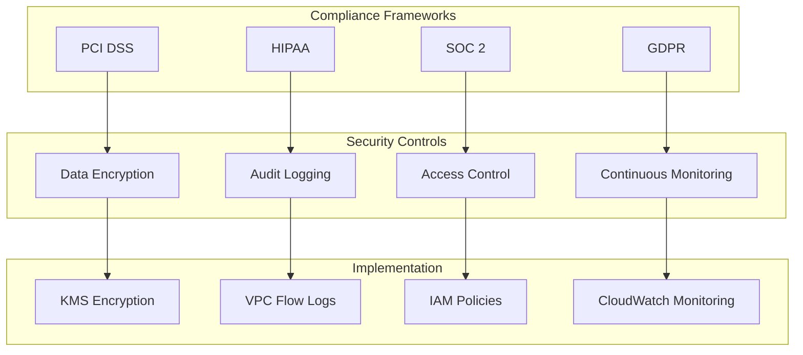

## Disaster Recovery Architecture

### Multi-Region Deployment

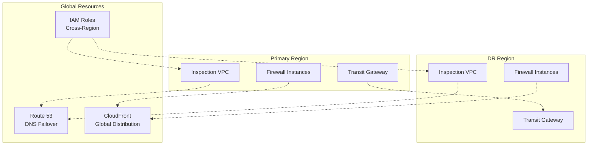

This architecture document provides the foundation for understanding the AWS centralized traffic inspection solution. For implementation details, refer to the deployment guide and troubleshooting documentation.