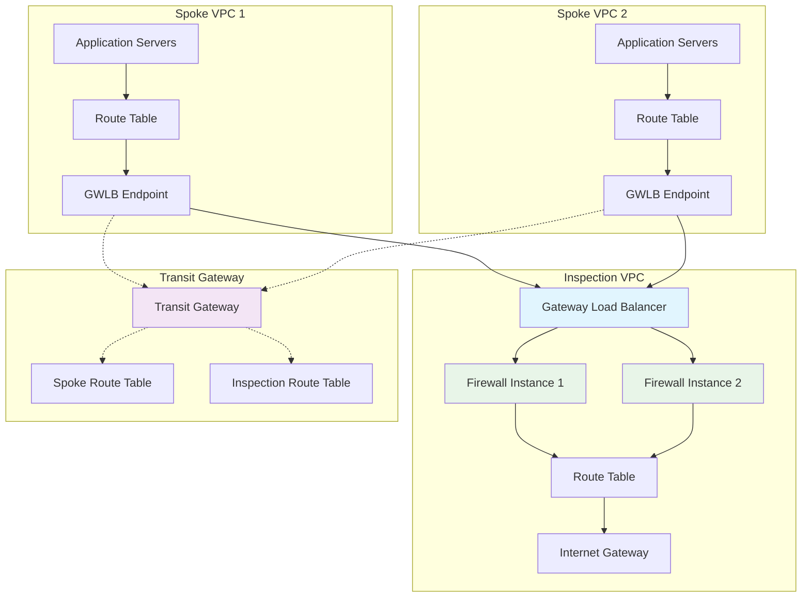

# AWS Centralized Traffic Inspection with Palo Alto Firewalls

[](https://terraform.io)
[](https://aws.amazon.com)
[](https://www.paloaltonetworks.com/products/vm-series)

This Terraform project deploys a production-ready AWS centralized traffic inspection architecture using Palo Alto firewalls with Gateway Load Balancer (GWLB), Transit Gateway (TGW), and support for both VM-Series and Cloud NGFW options.

## 🏗️ Architecture Overview

The architecture implements comprehensive traffic inspection for both north-south (internet-bound) and east-west (inter-VPC) traffic flows using AWS native services and Palo Alto Networks' advanced threat prevention capabilities.

### Core Components

- **🔍 Inspection VPC**: Dedicated VPC containing Gateway Load Balancer and firewall instances
- **🌐 Spoke VPCs**: Application VPCs with GWLB endpoints for traffic steering
- **🚦 Transit Gateway**: Enables routing between inspection and spoke VPCs with symmetric flows
- **🛡️ Firewalls**: Either VM-Series instances or Cloud NGFW for deep packet inspection
- **📊 Observability**: Comprehensive logging and monitoring across all traffic flows

### Traffic Flow Architecture



### Detailed Traffic Flows

#### North-South Traffic (Internet-bound)
1. **Outbound**: Application → Spoke Route Table → GWLB Endpoint → GWLB → Firewall → IGW
2. **Inbound**: IGW → Firewall → GWLB → GWLB Endpoint → Application

#### East-West Traffic (Inter-VPC)
1. **Inter-VPC**: Application → Spoke Route Table → GWLB Endpoint → GWLB → Firewall → TGW → Destination VPC
2. **Return Path**: Follows symmetric reverse path for stateful inspection

## ✨ Key Features

- **🔄 Dual Firewall Support**: Seamless switching between VM-Series and Cloud NGFW
- **📈 Auto-scaling**: VM-Series instances scale based on CPU/memory metrics
- **📊 Advanced Observability**: VPC Flow Logs, TGW Flow Logs, and Traffic Mirroring
- **🏗️ Modular Design**: Reusable Terraform modules with clear separation of concerns
- **🔀 Conditional Logic**: Deploy only required components based on configuration
- **🔒 Security-First**: Comprehensive security policies and compliance tagging
- **💰 Cost Optimization**: Feature toggles for selective resource deployment
- **🚀 CI/CD Ready**: GitHub Actions workflows and Makefile automation

## 📋 Prerequisites

### Required Tools
- **Terraform**: `>= 1.5.0`
- **AWS CLI**: `>= 2.0` with configured credentials
- **Git**: For version control
- **Make**: For automation scripts (optional but recommended)

### AWS Permissions
Ensure your AWS credentials have the following permissions:
```json
{
  "Version": "2012-10-17",
  "Statement": [
    {
      "Effect": "Allow",
      "Action": [
        "ec2:*",
        "elasticloadbalancing:*",
        "iam:*",
        "s3:*",
        "dynamodb:*",
        "logs:*",
        "cloudwatch:*",
        "kms:*"
      ],
      "Resource": "*"
    }
  ]
}
```

### Palo Alto Networks Requirements
- **For VM-Series**: Panorama server for centralized management
- **For Cloud NGFW**: Cloud NGFW subscription and appropriate AWS permissions

## 🚀 Quick Start

### 1. Clone and Setup
```bash
git clone <repository-url>
cd aws-centralized-inspection
```

### 2. Configure Environment
```bash
# Copy environment template
cp envs/dev.tfvars envs/my-deployment.tfvars

# Edit with your values
vim envs/my-deployment.tfvars
```

### 3. Initialize and Deploy
```bash
# Using Makefile (recommended)
make init ENV=my-deployment
make plan ENV=my-deployment
make apply ENV=my-deployment

# Or using Terraform directly
cd live
terraform init
terraform plan -var-file=../envs/my-deployment.tfvars
terraform apply -var-file=../envs/my-deployment.tfvars
```

### 4. Validate Deployment
```bash
# Run health checks
make validate-all ENV=my-deployment

# Or run individual checks
make health-check
make routing-check
```

## 📁 Project Structure

```
aws-centralized-inspection/
├── 📁 modules/                    # Reusable Terraform modules
│   ├── 📁 network/               # VPCs, subnets, TGW infrastructure
│   ├── 📁 inspection/            # GWLB, endpoints, traffic steering
│   ├── 📁 firewall-vmseries/     # VM-Series deployment & config
│   ├── 📁 firewall-cloudngfw/    # Cloud NGFW rule stacks
│   ├── 📁 observability/         # Flow logs, monitoring, alerting
│   └── 📁 panos-config/          # PAN-OS policy management
├── 📁 live/                      # Main deployment configuration
│   ├── main.tf                   # Module orchestrations
│   ├── outputs.tf                # Resource outputs
│   ├── variables.tf              # Input variables
│   └── backend.tf                # Remote state configuration
├── 📁 envs/                      # Environment-specific configurations
│   ├── dev.tfvars               # Development environment
│   ├── prod.tfvars              # Production environment
│   ├── vmseries.tfvars          # VM-Series specific config
│   └── cloudngfw.tfvars         # Cloud NGFW specific config
├── 📁 validation/               # Health check and validation scripts
│   ├── health-check.sh          # Infrastructure health validation
│   └── routing-check.sh         # Routing symmetry verification
├── 📁 .github/                  # CI/CD workflows
│   └── workflows/
│       └── terraform-plan.yml   # GitHub Actions CI/CD
├── 📄 Makefile                  # Automation commands
├── 📄 README.md                 # This file
└── 📄 variables.tf              # Global variable definitions
```

## Modules

### Core Modules
- `modules/network`: VPCs, subnets, Transit Gateway, route tables
- `modules/inspection`: Gateway Load Balancer, VPC endpoints
- `modules/observability`: Flow logs and monitoring

### Firewall Modules
- `modules/firewall-vmseries`: VM-Series deployment with auto-scaling
- `modules/firewall-cloudngfw`: Cloud NGFW rule stacks

### Configuration Modules
- `modules/panos-config`: PAN-OS security policies

## ⚙️ Configuration

### Core Configuration Variables

#### Inspection Engine Selection
```hcl
variable "inspection_engine" {
  description = "Choose inspection engine: 'vmseries' or 'cloudngfw'"
  type        = string
  default     = "vmseries"
  validation {
    condition     = contains(["vmseries", "cloudngfw"], var.inspection_engine)
    error_message = "Must be either 'vmseries' or 'cloudngfw'"
  }
}
```

#### Network Configuration
```hcl
# Inspection VPC settings
vpc_cidr = "10.0.0.0/16"           # Dedicated inspection VPC
tgw_asn  = 64512                   # Transit Gateway ASN

# Spoke VPCs (application environments)
spoke_vpc_cidrs = [
  "10.1.0.0/16",  # Development
  "10.2.0.0/16",  # Staging
  "10.3.0.0/16"   # Production
]
```

### VM-Series Configuration

#### Instance Configuration
```hcl
vmseries_version      = "10.2.0"      # PAN-OS version
vmseries_instance_type = "m5.xlarge"  # Instance size
vmseries_min_size     = 2             # Minimum instances
vmseries_max_size     = 4             # Maximum instances
key_name              = "vmseries-key" # SSH key pair
```

#### Panorama Integration
```hcl
panos_hostname = "panorama.example.com"
panos_username = "admin"
# panos_password set via TF_VAR_panos_password or environment
```

#### Security Rules Example
```hcl
security_rules = [
  {
    name                = "allow-web-traffic"
    action              = "allow"
    source_zones        = ["trust"]
    destination_zones   = ["untrust"]
    source_addresses    = ["10.1.0.0/16", "10.2.0.0/16"]
    destination_addresses = ["0.0.0.0/0"]
    applications        = ["web-browsing", "ssl"]
    services            = ["service-http", "service-https"]
  },
  {
    name                = "allow-ssh"
    action              = "allow"
    source_zones        = ["trust"]
    destination_zones   = ["untrust"]
    source_addresses    = ["10.0.0.0/8"]
    destination_addresses = ["0.0.0.0/0"]
    applications        = ["ssh"]
    services            = ["application-default"]
  }
]
```

### Cloud NGFW Configuration

#### Rule Stack Configuration
```hcl
cloudngfw_rule_stack_name = "inspection-rule-stack"
```

### Feature Toggles

#### Observability Settings
```hcl
enable_flow_logs         = true   # VPC and TGW flow logs
enable_traffic_mirroring = false  # Traffic mirroring (cost optimization)
enable_panos_config      = true   # PAN-OS policy management
```

#### Tagging Strategy
```hcl
tags = {
  Environment   = "production"
  Project       = "centralized-inspection"
  Owner         = "security-team"
  CostCenter    = "security"
  Compliance    = "pci-dss"
}
```

### Environment-Specific Configurations

#### Development Environment
```hcl
# envs/dev.tfvars
inspection_engine = "vmseries"
enable_flow_logs  = true
vmseries_min_size = 1
vmseries_max_size = 2
```

#### Production Environment
```hcl
# envs/prod.tfvars
inspection_engine = "vmseries"
enable_flow_logs  = true
vmseries_min_size = 3
vmseries_max_size = 6
```

### AWS Provider Configuration

#### Basic Authentication
```hcl
aws_region  = "us-east-1"
aws_profile = "default"
```

#### Cross-Account Deployment
```hcl
aws_assume_role_arn = "arn:aws:iam::123456789012:role/TerraformDeploymentRole"
```

## 🔧 Advanced Configuration

### Custom AMI Configuration
```hcl
# For custom VM-Series AMIs
vmseries_ami_id = "ami-12345678"  # Custom AMI ID
```

### Multi-Region Deployment
```hcl
# For multi-region architectures
regions = ["us-east-1", "us-west-2"]
tgw_peering = true
```

### High Availability Configuration
```hcl
# Enhanced availability settings
availability_zones = ["us-east-1a", "us-east-1b", "us-east-1c"]
cross_zone_load_balancing = true
multi_az_deployment = true
```

## 📊 Outputs

The deployment provides comprehensive outputs for integration and monitoring:

### Network Infrastructure
```hcl
# VPC and Subnet Information
inspection_vpc_id = "vpc-12345678"
spoke_vpc_ids     = ["vpc-87654321", "vpc-11223344"]
subnet_ids        = ["subnet-11111111", "subnet-22222222"]

# Transit Gateway
transit_gateway_id = "tgw-12345678"
tgw_attachments    = ["tgw-attach-111", "tgw-attach-222"]
```

### Inspection Components
```hcl
# Gateway Load Balancer
gwlb_arn             = "arn:aws:elasticloadbalancing:us-east-1:123456789012:loadbalancer/gw/inspection-gwlb/1234567890abcdef"
endpoint_service_name = "com.amazonaws.vpce.us-east-1.vpce-svc-1234567890abcdef"

# Target Groups
target_group_arn = "arn:aws:elasticloadbalancing:us-east-1:123456789012:targetgroup/inspection-tg/1234567890abcdef"
```

### Firewall Resources
```hcl
# VM-Series (when selected)
vmseries_asg_name = "vmseries-asg"
launch_template_id = "lt-12345678"

# Cloud NGFW (when selected)
cloudngfw_rule_stack_arn = "arn:aws:cloudngfw:us-east-1:123456789012:rule-stack/inspection-rule-stack"
```

### Observability
```hcl
# Flow Logs
vpc_flow_log_ids = ["fl-11111111", "fl-22222222"]
tgw_flow_log_id  = "fl-33333333"

# CloudWatch Logs
log_group_names = ["/aws/vpc/flow-logs/inspection", "/aws/tgw/flow-logs"]
```

## 🔒 Security Considerations

### Network Security
- **Zero Trust Architecture**: All traffic inspected regardless of source/destination
- **Defense in Depth**: Multiple security layers (GWLB, firewalls, route controls)
- **Symmetric Routing**: Ensures stateful inspection for return traffic
- **Network Segmentation**: Dedicated inspection VPC isolates security infrastructure

### Access Control
- **Least Privilege**: IAM roles with minimal required permissions
- **Cross-Account Support**: Assume role patterns for multi-account deployments
- **SSH Key Management**: Secure key pair management for VM-Series access
- **API Authentication**: Secure credential handling for Panorama integration

### Data Protection
- **Encryption at Rest**: S3 buckets encrypted with KMS
- **Encryption in Transit**: TLS 1.2+ for all communications
- **Sensitive Data Handling**: Terraform sensitive variables for credentials
- **Audit Logging**: Comprehensive CloudTrail and VPC Flow Logs

### Compliance
- **PCI DSS**: Payment card data protection
- **HIPAA**: Healthcare data compliance
- **SOC 2**: Security, availability, and confidentiality
- **GDPR**: Data protection and privacy

### Security Best Practices
```hcl
# Security group example
resource "aws_security_group" "inspection" {
  name_prefix = "inspection-sg-"

  ingress {
    from_port   = 6081
    to_port     = 6081
    protocol    = "udp"
    cidr_blocks = ["10.0.0.0/8"]  # Internal networks only
  }

  # No public ingress
  # Egress restricted to necessary services
}
```

## 🔧 Troubleshooting

### Common Issues and Solutions

#### 1. GWLB Endpoint Connection Issues
**Symptoms:**
- Traffic not being inspected
- VPC endpoint in failed state

**Solutions:**
```bash
# Check VPC endpoint status
aws ec2 describe-vpc-endpoints --vpc-endpoint-ids vpce-12345

# Verify security groups
aws ec2 describe-security-groups --group-ids sg-12345

# Check route tables
aws ec2 describe-route-tables --route-table-ids rtb-12345
```

**Prevention:**
- Ensure GWLB subnets have proper IGW routes
- Verify endpoint service is available
- Check cross-region endpoint permissions

#### 2. VM-Series Bootstrap Failures
**Symptoms:**
- Instances not registering with Panorama
- Bootstrap logs show connection errors

**Solutions:**
```bash
# Check Panorama connectivity
telnet panorama.example.com 3978

# Verify bootstrap configuration
aws s3 ls s3://vmseries-bootstrap/

# Check instance logs
aws logs get-log-events --log-group-name /aws/vmseries/bootstrap
```

**Prevention:**
- Ensure Panorama security groups allow VM-Series traffic
- Verify bootstrap S3 bucket permissions
- Check DNS resolution for Panorama hostname

#### 3. Routing Asymmetry Issues
**Symptoms:**
- One-way traffic flows
- Intermittent connectivity

**Solutions:**
```bash
# Validate TGW route tables
aws ec2 describe-transit-gateway-route-tables --transit-gateway-route-table-ids tgw-rtb-12345

# Check spoke VPC routes
aws ec2 describe-route-tables --filters "Name=vpc-id,Values=vpc-12345"

# Verify GWLB endpoint routes
aws ec2 describe-vpc-endpoints --filters "Name=service-name,Values=*gwlb*"
```

#### 4. Auto-scaling Problems
**Symptoms:**
- Instances not scaling up/down
- Alarms not triggering

**Solutions:**
```bash
# Check auto-scaling group
aws autoscaling describe-auto-scaling-groups --auto-scaling-group-names vmseries-asg

# Verify CloudWatch alarms
aws cloudwatch describe-alarms --alarm-names vmseries-cpu-high

# Check scaling policies
aws autoscaling describe-policies --auto-scaling-group-name vmseries-asg
```

#### 5. Flow Log Delivery Issues
**Symptoms:**
- No logs appearing in S3/CloudWatch
- Permission errors in logs

**Solutions:**
```bash
# Check flow log status
aws ec2 describe-flow-logs --flow-log-ids fl-12345

# Verify IAM permissions
aws iam simulate-principal-policy --policy-source-arn arn:aws:iam::123456789012:role/FlowLogRole

# Check S3 bucket permissions
aws s3api get-bucket-policy --bucket flow-logs-bucket
```

### Diagnostic Commands

#### Health Check Script
```bash
#!/bin/bash
# Run comprehensive health checks
./validation/health-check.sh

# Check specific components
aws elbv2 describe-load-balancers --names inspection-gwlb
aws ec2 describe-transit-gateways --transit-gateway-ids tgw-12345
aws autoscaling describe-auto-scaling-groups --auto-scaling-group-names vmseries-asg
```

#### Network Connectivity Test
```bash
# Test GWLB connectivity
curl -v telnet://gwlb-endpoint-ip:6081

# Test Panorama connectivity
openssl s_client -connect panorama.example.com:3978

# Test TGW attachments
aws ec2 describe-transit-gateway-attachments --transit-gateway-id tgw-12345
```

### Performance Troubleshooting

#### High Latency Issues
1. **Check GWLB target health**
   ```bash
   aws elbv2 describe-target-health --target-group-arn $TARGET_GROUP_ARN
   ```

2. **Monitor CloudWatch metrics**
   ```bash
   aws cloudwatch get-metric-statistics \
     --namespace AWS/GatewayELB \
     --metric-name UnHealthyHostCount \
     --start-time 2023-01-01T00:00:00Z \
     --end-time 2023-01-02T00:00:00Z \
     --period 300 \
     --statistics Maximum
   ```

3. **Review VM-Series performance**
   ```bash
   aws cloudwatch get-metric-statistics \
     --namespace AWS/EC2 \
     --metric-name CPUUtilization \
     --dimensions Name=AutoScalingGroupName,Value=vmseries-asg
   ```

#### Throughput Issues
1. **Scale up instances**
   ```bash
   aws autoscaling update-auto-scaling-group \
     --auto-scaling-group-name vmseries-asg \
     --min-size 4 \
     --max-size 8
   ```

2. **Enable cross-zone load balancing**
   ```bash
   aws elbv2 modify-load-balancer-attributes \
     --load-balancer-arn $GWLB_ARN \
     --attributes Key=load_balancing.cross_zone.enabled,Value=true
   ```

### Logging and Monitoring

#### Enable Debug Logging
```bash
# VM-Series debug logging
aws logs create-log-group --log-group-name /aws/vmseries/debug

# Panorama integration logs
aws logs create-log-group --log-group-name /aws/panorama/integration
```

#### Custom CloudWatch Dashboards
```json
{
  "widgets": [
    {
      "type": "metric",
      "properties": {
        "metrics": [
          ["AWS/GatewayELB", "ActiveFlowCount", "LoadBalancer", "inspection-gwlb"],
          ["AWS/GatewayELB", "ProcessedBytes", "LoadBalancer", "inspection-gwlb"]
        ],
        "title": "GWLB Traffic Metrics"
      }
    }
  ]
}
```

## 💰 Cost Optimization

### Cost-Saving Strategies

#### 1. Selective Feature Enablement
```hcl
# Production - enable all features
enable_flow_logs         = true
enable_traffic_mirroring = true

# Development - minimize costs
enable_flow_logs         = false
enable_traffic_mirroring = false
```

#### 2. Auto-scaling Configuration
```hcl
# Right-size for your workload
vmseries_min_size = 2  # Minimum for HA
vmseries_max_size = 4  # Scale up as needed

# Use appropriate instance types
vmseries_instance_type = "m5.large"  # Instead of m5.xlarge
```

#### 3. Resource Scheduling
```hcl
# Development environment - scale down during off-hours
resource "aws_autoscaling_schedule" "scale_down" {
  scheduled_action_name  = "scale_down"
  min_size              = 1
  max_size              = 2
  desired_capacity      = 1
  recurrence            = "0 18 * * 1-5"  # 6 PM weekdays
}

resource "aws_autoscaling_schedule" "scale_up" {
  scheduled_action_name  = "scale_up"
  min_size              = 2
  max_size              = 4
  desired_capacity      = 2
  recurrence            = "0 6 * * 1-5"   # 6 AM weekdays
}
```

### Cost Monitoring

#### CloudWatch Cost Dashboards
```hcl
# Monitor costs by service
resource "aws_cloudwatch_dashboard" "cost_monitoring" {
  dashboard_name = "inspection-cost-monitoring"

  dashboard_body = jsonencode({
    widgets = [
      {
        type = "metric"
        properties = {
          metrics = [
            ["AWS/EC2", "CPUCreditUsage"],
            ["AWS/GatewayELB", "ProcessedBytes"],
            ["AWS/VPC", "DataTransfer-Out-Bytes"]
          ]
          title = "Resource Usage Costs"
        }
      }
    ]
  })
}
```

#### Cost Allocation Tags
```hcl
tags = {
  Environment        = "production"
  Project           = "centralized-inspection"
  CostCenter        = "security-operations"
  Owner             = "security-team"
  Backup            = "daily"
  DataClassification = "sensitive"
}
```

## 🏆 Best Practices

### Architecture Best Practices

#### 1. Network Design
- **Dedicated Inspection VPC**: Isolate security infrastructure
- **Multiple AZs**: Ensure high availability
- **Symmetric Routing**: Maintain stateful inspection
- **Route Optimization**: Minimize hops for performance

#### 2. Security Best Practices
- **Defense in Depth**: Multiple security layers
- **Zero Trust**: Inspect all traffic flows
- **Least Privilege**: Minimal required permissions
- **Regular Updates**: Keep firewall software current

#### 3. Operational Best Practices
- **Monitoring**: Comprehensive observability
- **Automation**: Infrastructure as code
- **Documentation**: Keep configs documented
- **Testing**: Validate changes before production

### Deployment Best Practices

#### Pre-Deployment Checklist
- [ ] AWS credentials configured with appropriate permissions
- [ ] Panorama accessible and configured
- [ ] Network ranges don't conflict
- [ ] Security groups reviewed and approved
- [ ] Cost estimates reviewed and approved

#### Deployment Workflow
```bash
# 1. Validate configuration
make validate ENV=prod

# 2. Plan deployment
make plan ENV=prod

# 3. Review changes
# (manual review of terraform plan output)

# 4. Deploy with approval
make apply ENV=prod

# 5. Validate deployment
make validate-all ENV=prod

# 6. Update documentation
# (update any runbooks or diagrams)
```

### Maintenance Best Practices

#### Regular Tasks
- **Weekly**: Review CloudWatch alarms and metrics
- **Monthly**: Update AMI versions and security patches
- **Quarterly**: Review and optimize costs
- **Annually**: Security assessment and compliance review

#### Backup and Recovery
```hcl
# S3 backup configuration
resource "aws_s3_bucket" "backups" {
  bucket = "inspection-backups-${random_string.suffix.result}"

  versioning {
    enabled = true
  }

  lifecycle {
    prevent_destroy = true
  }
}
```

## 🤝 Contributing

### Development Workflow

1. **Fork the Repository**
   ```bash
   git clone https://github.com/your-org/aws-centralized-inspection.git
   cd aws-centralized-inspection
   git checkout -b feature/new-feature
   ```

2. **Set Up Development Environment**
   ```bash
   # Install dependencies
   terraform init

   # Configure pre-commit hooks
   pre-commit install
   ```

3. **Make Changes**
   ```bash
   # Follow conventional commit format
   git commit -m "feat: add new inspection feature"
   ```

4. **Test Changes**
   ```bash
   # Run validation
   make validate-all

   # Run tests (if available)
   make test
   ```

5. **Submit Pull Request**
   ```bash
   git push origin feature/new-feature
   # Create PR with detailed description
   ```

### Code Standards

#### Terraform Standards
- Use consistent naming conventions
- Add descriptive comments
- Use locals for complex expressions
- Validate all inputs with constraints

#### Documentation Standards
- Update README for new features
- Add examples for configuration options
- Document breaking changes
- Keep diagrams current

### Testing Requirements

#### Unit Tests
```bash
# Run Terraform validation
terraform validate

# Check formatting
terraform fmt -check
```

#### Integration Tests
```bash
# Deploy to test environment
make apply ENV=test

# Run health checks
make validate-all ENV=test

# Clean up
make destroy ENV=test
```

## 📚 Additional Resources

### Documentation
- [AWS Gateway Load Balancer Documentation](https://docs.aws.amazon.com/elasticloadbalancing/latest/gateway/)
- [Palo Alto VM-Series Documentation](https://docs.paloaltonetworks.com/vm-series)
- [Cloud NGFW Documentation](https://docs.paloaltonetworks.com/cloud-ngfw)
- [Terraform AWS Provider](https://registry.terraform.io/providers/hashicorp/aws/latest)

### Related Projects
- [AWS Centralized Inspection Reference](https://github.com/aws-samples/aws-centralized-inspection)
- [Palo Alto Terraform Modules](https://registry.terraform.io/modules/PaloAltoNetworks)
- [AWS Network Firewall](https://docs.aws.amazon.com/network-firewall/)

### Support
- **Issues**: [GitHub Issues](https://github.com/your-org/aws-centralized-inspection/issues)
- **Discussions**: [GitHub Discussions](https://github.com/your-org/aws-centralized-inspection/discussions)
- **Documentation**: [Wiki](https://github.com/your-org/aws-centralized-inspection/wiki)

## 📄 License

This project is licensed under the MIT License - see the [LICENSE](LICENSE) file for details.

## 🙏 Acknowledgments

- Palo Alto Networks for VM-Series and Cloud NGFW
- AWS for Gateway Load Balancer and Transit Gateway
- Terraform community for infrastructure as code
- Contributors and maintainers

---

**Happy Inspecting! 🔍🛡️**

For questions or support, please open an issue or start a discussion in the repository.