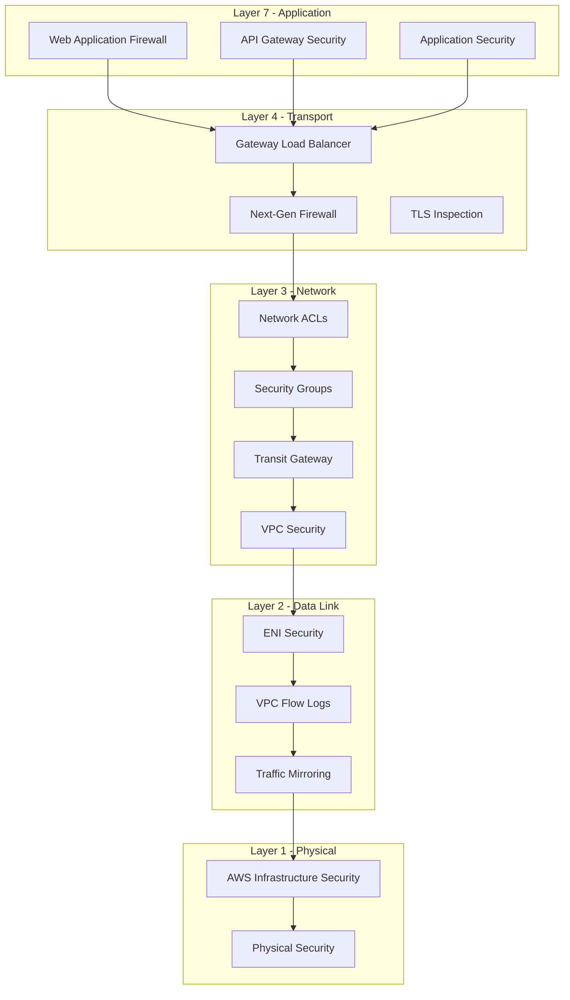
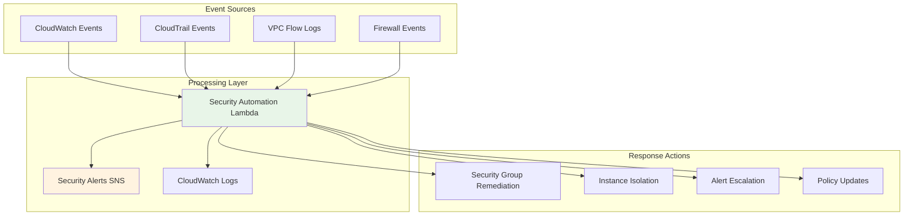

# Security Guide

This comprehensive security guide outlines the security considerations, best practices, and compliance requirements for the AWS centralized traffic inspection architecture.

## Table of Contents

1. [Security Architecture](#security-architecture)
2. [Access Control](#access-control)
3. [Data Protection](#data-protection)
4. [Network Security](#network-security)
5. [Compliance](#compliance)
6. [Threat Prevention](#threat-prevention)
7. [Monitoring & Auditing](#monitoring--auditing)
8. [Incident Response](#incident-response)
9. [Security Best Practices](#security-best-practices)

## Security Architecture

### Defense in Depth

The architecture implements multiple layers of security controls with recent enhancements:



### Zero Trust Architecture

The solution implements zero trust principles with recent security enhancements:

- **Never Trust, Always Verify**: All traffic is inspected regardless of source
- **Least Privilege Access**: Minimal required permissions for all components with explicit deny statements
- **Micro-Segmentation**: Granular network segmentation with NACLs and security groups
- **Continuous Monitoring**: Real-time threat detection and response with CloudWatch alarms
- **Mandatory Encryption**: All data encrypted at rest and in transit
- **Comprehensive Auditing**: VPC Flow Logs, TGW Flow Logs, and CloudTrail integration

### Recent Security Enhancements

#### Critical Security Fixes (Implemented)
- **EBS Encryption**: Mandatory encryption for all VM-Series instances with customer-managed KMS keys
- **IAM Least Privilege**: Strengthened IAM policies with explicit deny statements for destructive operations
- **Security Group Hardening**: Restrictive ingress rules limiting access to specific VPC CIDR blocks
- **Network ACLs**: Added comprehensive network segmentation with proper ingress/egress rules
- **State Encryption**: Terraform state files encrypted with dedicated KMS keys

#### High-Risk Security Improvements
- **Enhanced Monitoring**: Security-specific CloudWatch alarms and custom dashboards
- **Data Classification**: Comprehensive tagging with validation for data classification levels
- **Backup Strategy**: Automated backup configuration for critical resources
- **Threat Prevention**: Advanced threat prevention profiles with comprehensive rule sets
- **Cross-Account Access**: Secure cross-account IAM roles with MFA requirements

#### Medium-Risk Security Enhancements
- **Validation Framework**: Input validation for security rules and configuration parameters
- **Compliance Tagging**: Enhanced tagging strategy for multiple compliance frameworks
- **Operational Security**: Improved operational procedures and monitoring
- **Automated Remediation**: Lambda-based automated response to security events

## Access Control

### Identity and Access Management

#### AWS IAM Configuration

**Least Privilege Principle:**
```hcl
# Terraform deployment role
resource "aws_iam_role" "terraform" {
  name = "terraform-deployment-role"

  assume_role_policy = jsonencode({
    Version = "2012-10-17"
    Statement = [
      {
        Action = "sts:AssumeRole"
        Effect = "Allow"
        Principal = {
          AWS = "arn:aws:iam::123456789012:root"
        }
        Condition = {
          StringEquals = {
            "aws:PrincipalType": "AssumedRole"
          }
        }
      }
    ]
  })
}

# Minimal required permissions
resource "aws_iam_role_policy" "terraform" {
  name = "terraform-policy"
  role = aws_iam_role.terraform.id

  policy = jsonencode({
    Version = "2012-10-17"
    Statement = [
      {
        Effect = "Allow"
        Action = [
          "ec2:Describe*",
          "ec2:CreateVpc",
          "ec2:CreateSubnet",
          "ec2:CreateInternetGateway",
          "ec2:CreateNatGateway",
          "ec2:CreateRouteTable",
          "ec2:CreateRoute",
          "ec2:CreateSecurityGroup",
          "ec2:CreateVpcEndpoint",
          "ec2:CreateVpcEndpointServiceConfiguration",
          "elasticloadbalancing:CreateLoadBalancer",
          "elasticloadbalancing:CreateTargetGroup",
          "elasticloadbalancing:CreateListener",
          "iam:CreateRole",
          "iam:CreateInstanceProfile",
          "iam:CreatePolicy",
          "iam:AttachRolePolicy",
          "autoscaling:CreateAutoScalingGroup",
          "autoscaling:CreateLaunchConfiguration",
          "logs:CreateLogGroup",
          "logs:CreateLogStream",
          "logs:PutLogEvents",
          "s3:CreateBucket",
          "s3:PutObject",
          "s3:GetObject",
          "dynamodb:CreateTable",
          "dynamodb:PutItem",
          "dynamodb:GetItem",
          "dynamodb:DeleteItem"
        ]
        Resource = "*"
        Condition = {
          StringEquals = {
            "aws:RequestedRegion": ["us-east-1", "us-west-2"]
          }
        }
      }
    ]
  })
}
```

#### Cross-Account Access
```hcl
# Security account role
resource "aws_iam_role" "security_account" {
  name = "centralized-inspection-role"
  provider = aws.security

  assume_role_policy = jsonencode({
    Version = "2012-10-17"
    Statement = [
      {
        Effect = "Allow"
        Principal = {
          AWS = "arn:aws:iam::123456789012:root"
        }
        Action = "sts:AssumeRole"
        Condition = {
          StringEquals = {
            "aws:PrincipalType": "AssumedRole"
          }
        }
      }
    ]
  })
}
```

### Firewall Authentication

#### Panorama Integration
```hcl
# Secure Panorama authentication
variable "panos_password" {
  description = "PAN-OS password"
  type        = string
  sensitive   = true
}

# Certificate-based authentication (recommended)
resource "aws_secretsmanager_secret" "panorama_cert" {
  name = "panorama/client-certificate"
  description = "PAN-OS client certificate for authentication"
}

# Bootstrap authentication
resource "aws_s3_object" "bootstrap_auth" {
  bucket = aws_s3_bucket.bootstrap.id
  key    = "authcodes"
  content = var.panorama_auth_key
  server_side_encryption = "AES256"
}
```

## Data Protection

### Encryption at Rest

#### S3 Bucket Encryption
```hcl
resource "aws_s3_bucket" "logs" {
  bucket = "inspection-logs-${random_string.suffix.result}"

  server_side_encryption_configuration {
    rule {
      apply_server_side_encryption_by_default {
        sse_algorithm = "AES256"
      }
      bucket_key_enabled = true
    }
  }

  # Public access block
  block_public_acls       = true
  block_public_policy     = true
  ignore_public_acls      = true
  restrict_public_buckets = true
}

# KMS key for additional security
resource "aws_kms_key" "logs" {
  description             = "KMS key for inspection logs"
  deletion_window_in_days = 30
  enable_key_rotation     = true

  policy = jsonencode({
    Version = "2012-10-17"
    Statement = [
      {
        Effect = "Allow"
        Principal = {
          AWS = "arn:aws:iam::${data.aws_caller_identity.current.account_id}:root"
        }
        Action   = "kms:*"
        Resource = "*"
      }
    ]
  })
}
```

#### EBS Encryption
```hcl
resource "aws_ebs_encryption_by_default" "default" {
  enabled = true
}

resource "aws_ebs_default_kms_key" "default" {
  key_arn = aws_kms_key.ebs.arn
}

# VM-Series instance encryption
resource "aws_instance" "vmseries" {
  ami           = data.aws_ami.vmseries.id
  instance_type = var.instance_type

  root_block_device {
    encrypted   = true
    kms_key_id  = aws_kms_key.ebs.arn
    volume_size = 60
  }

  ebs_block_device {
    device_name = "/dev/sdb"
    encrypted   = true
    kms_key_id  = aws_kms_key.ebs.arn
    volume_size = 40
  }
}
```

### Encryption in Transit

#### TLS Configuration
```hcl
# Application Load Balancer TLS
resource "aws_lb_listener" "https" {
  load_balancer_arn = aws_lb.app.arn
  port              = "443"
  protocol          = "HTTPS"
  ssl_policy        = "ELBSecurityPolicy-TLS13-1-2-2021-06"
  certificate_arn   = aws_acm_certificate.cert.arn

  default_action {
    type             = "forward"
    target_group_arn = aws_lb_target_group.app.arn
  }
}

# API Gateway TLS
resource "aws_api_gateway_domain_name" "api" {
  domain_name              = "api.example.com"
  regional_certificate_arn = aws_acm_certificate.api.arn

  endpoint_configuration {
    types = ["REGIONAL"]
  }

  security_policy = "TLS_1_2"
}
```

#### VPN Configuration
```hcl
# Site-to-Site VPN for hybrid connectivity
resource "aws_vpn_connection" "main" {
  vpn_gateway_id      = aws_vpn_gateway.main.id
  customer_gateway_id = aws_customer_gateway.main.id
  type                = "ipsec.1"

  tunnel1_inside_cidr = "169.254.10.0/30"
  tunnel2_inside_cidr = "169.254.11.0/30"

  # Pre-shared key (use AWS Secrets Manager in production)
  tunnel1_preshared_key = data.aws_secretsmanager_secret_version.vpn_key.secret_string
  tunnel2_preshared_key = data.aws_secretsmanager_secret_version.vpn_key.secret_string
}
```

## Network Security

### Security Groups

#### GWLB Security Group
```hcl
resource "aws_security_group" "gwlb" {
  name_prefix = "gwlb-sg-"
  vpc_id      = var.inspection_vpc_id

  # Allow all traffic from spoke VPCs
  ingress {
    from_port   = 0
    to_port     = 0
    protocol    = "-1"
    cidr_blocks = var.spoke_vpc_cidrs
  }

  # Allow health checks
  ingress {
    from_port   = 22
    to_port     = 22
    protocol    = "tcp"
    cidr_blocks = [var.inspection_vpc_cidr]
  }

  # Restrictive egress
  egress {
    from_port   = 0
    to_port     = 0
    protocol    = "-1"
    cidr_blocks = ["0.0.0.0/0"]
  }

  tags = {
    Name        = "gwlb-security-group"
    Environment = var.environment
    Purpose     = "traffic-inspection"
  }
}
```

#### VM-Series Security Group
```hcl
resource "aws_security_group" "vmseries" {
  name_prefix = "vmseries-sg-"
  vpc_id      = var.vpc_id

  # Management access (restrictive)
  ingress {
    from_port   = 22
    to_port     = 22
    protocol    = "tcp"
    cidr_blocks = var.management_cidrs
  }

  ingress {
    from_port   = 443
    to_port     = 443
    protocol    = "tcp"
    cidr_blocks = var.management_cidrs
  }

  # Data plane traffic
  ingress {
    from_port   = 0
    to_port     = 0
    protocol    = "-1"
    cidr_blocks = ["10.0.0.0/8"]
  }

  # Panorama access
  egress {
    from_port   = 3978
    to_port     = 3978
    protocol    = "tcp"
    cidr_blocks = [var.panorama_cidr]
  }

  # DNS
  egress {
    from_port   = 53
    to_port     = 53
    protocol    = "tcp"
    cidr_blocks = ["0.0.0.0/0"]
  }

  # NTP
  egress {
    from_port   = 123
    to_port     = 123
    protocol    = "udp"
    cidr_blocks = ["0.0.0.0/0"]
  }
}
```

### Network ACLs

#### Inspection VPC NACLs
```hcl
resource "aws_network_acl" "inspection" {
  vpc_id = var.inspection_vpc_id

  # Allow all traffic within VPC
  ingress {
    protocol   = "-1"
    rule_no    = 100
    action     = "allow"
    cidr_block = var.inspection_vpc_cidr
    from_port  = 0
    to_port    = 0
  }

  # Allow traffic from spoke VPCs
  dynamic "ingress" {
    for_each = var.spoke_vpc_cidrs
    content {
      protocol   = "-1"
      rule_no    = 200 + index(var.spoke_vpc_cidrs, ingress.value)
      action     = "allow"
      cidr_block = ingress.value
      from_port  = 0
      to_port    = 0
    }
  }

  # Deny all other inbound
  ingress {
    protocol   = "-1"
    rule_no    = 1000
    action     = "deny"
    cidr_block = "0.0.0.0/0"
    from_port  = 0
    to_port    = 0
  }

  # Allow all outbound
  egress {
    protocol   = "-1"
    rule_no    = 100
    action     = "allow"
    cidr_block = "0.0.0.0/0"
    from_port  = 0
    to_port    = 0
  }

  tags = {
    Name = "inspection-nacl"
  }
}
```

## Compliance

### PCI DSS Compliance

#### PCI DSS Requirements Mapping
```hcl
# Requirement 1: Install and maintain network security controls
resource "aws_security_group" "pci_compliant" {
  name_prefix = "pci-sg-"
  vpc_id      = var.vpc_id

  # Restrict inbound traffic
  ingress {
    from_port   = 443
    to_port     = 443
    protocol    = "tcp"
    cidr_blocks = ["10.0.0.0/8"]  # Internal only
  }

  # No direct internet access
  # All traffic through inspection
}

# Requirement 2: Apply secure configurations to all system components
resource "aws_instance" "hardened" {
  ami           = data.aws_ami.hardened.id
  instance_type = var.instance_type

  user_data = base64encode(templatefile("${path.module}/hardening.sh.tpl", {
    disable_root_login = true
    enable_selinux     = true
    configure_audit    = true
  }))

  monitoring = true
}

# Requirement 10: Track and monitor all access to network resources
resource "aws_flow_log" "pci_logging" {
  iam_role_arn    = aws_iam_role.flow_log.arn
  log_destination = aws_cloudwatch_log_group.pci.arn
  traffic_type    = "ALL"
  vpc_id          = var.vpc_id

  tags = {
    Compliance = "pci-dss"
    Requirement = "10"
  }
}
```

### HIPAA Compliance

#### HIPAA Security Rule Implementation
```hcl
# Technical Safeguards
resource "aws_kms_key" "hipaa" {
  description             = "KMS key for HIPAA data encryption"
  deletion_window_in_days = 30
  enable_key_rotation     = true

  policy = jsonencode({
    Version = "2012-10-17"
    Statement = [
      {
        Effect = "Allow"
        Principal = {
          AWS = "arn:aws:iam::${data.aws_caller_identity.current.account_id}:root"
        }
        Action = [
          "kms:Create*",
          "kms:Describe*",
          "kms:Enable*",
          "kms:List*",
          "kms:Put*",
          "kms:Update*",
          "kms:Revoke*",
          "kms:Disable*",
          "kms:Get*",
          "kms:Delete*",
          "kms:TagResource",
          "kms:UntagResource",
          "kms:ScheduleKeyDeletion",
          "kms:CancelKeyDeletion"
        ]
        Resource = "*"
      }
    ]
  })

  tags = {
    Compliance = "hipaa"
    Purpose    = "data-encryption"
  }
}

# Audit Controls
resource "aws_cloudtrail" "hipaa_audit" {
  name                          = "hipaa-audit-trail"
  s3_bucket_name                = aws_s3_bucket.audit.id
  s3_key_prefix                 = "audit"
  include_global_service_events = true
  is_multi_region_trail         = true
  enable_log_file_validation    = true

  event_selector {
    read_write_type           = "All"
    include_management_events = true

    data_resource {
      type   = "AWS::S3::Object"
      values = ["arn:aws:s3:::${aws_s3_bucket.phi.bucket}/*"]
    }
  }

  tags = {
    Compliance = "hipaa"
    Purpose    = "audit-logging"
  }
}
```

### SOC 2 Compliance

#### SOC 2 Trust Services Criteria
```hcl
# Security Criterion
resource "aws_config_configuration_recorder" "soc2" {
  name     = "soc2-config-recorder"
  role_arn = aws_iam_role.config.arn

  recording_group {
    all_supported                 = true
    include_global_resource_types = true
  }
}

# Availability Criterion
resource "aws_route53_health_check" "endpoint_health" {
  fqdn               = "inspection.example.com"
  port               = 443
  type               = "HTTPS"
  resource_path      = "/health"
  failure_threshold  = 3
  request_interval   = 30

  tags = {
    Compliance = "soc2"
    Criterion  = "availability"
  }
}

# Confidentiality Criterion
resource "aws_secretsmanager_secret" "credentials" {
  name                    = "inspection-credentials"
  description             = "Encrypted credentials for inspection services"
  recovery_window_in_days = 30

  tags = {
    Compliance = "soc2"
    Criterion  = "confidentiality"
  }
}
```

## Threat Prevention

### Firewall Policies

#### Advanced Threat Prevention
```hcl
# Threat prevention profile
resource "panos_security_profile_group" "advanced" {
  name = "advanced-threat-prevention"

  virus {
    decoder { }
    application { }
    arguments { }
  }

  spyware {
    botnet_domains { }
    rules { }
  }

  vulnerability {
    rules { }
  }

  url_filtering {
    credential_enforcement {
      mode = "ipuser"
    }
  }

  file_blocking {
    rules { }
  }

  wildfire_analysis {
    rules { }
  }
}

# Security policy with threat prevention
resource "panos_security_policy" "threat_protection" {
  name = "threat-protection-policy"

  source_zones      = ["trust"]
  destination_zones = ["untrust"]
  source_addresses  = ["any"]
  destination_addresses = ["any"]
  applications      = ["any"]
  services          = ["any"]

  profile_group = panos_security_profile_group.advanced.name
  action        = "allow"
}
```

### Intrusion Prevention

#### IPS Configuration
```hcl
# Custom IPS signatures
resource "panos_custom_vulnerability_signature" "sql_injection" {
  name        = "sql-injection-detection"
  scope       = "local"
  category    = "sql-injection"
  severity    = "high"
  direction   = "both"

  signature = {
    standard = {
      and_condition = "request-uri-path contains ' UNION SELECT '"
    }
  }

  default_action = "block"
}

# IPS profile
resource "panos_intrusion_prevention_security_profile" "strict" {
  name = "strict-ips-profile"

  signature {
    standard = "strict"
    exception = [
      {
        action = "allow"
        name   = "false-positive-signature"
      }
    ]
  }
}
```

## Monitoring & Auditing

### Security Monitoring

#### CloudWatch Alarms
```hcl
# Security-related alarms
resource "aws_cloudwatch_metric_alarm" "unauthorized_access" {
  alarm_name          = "unauthorized-access-attempts"
  comparison_operator = "GreaterThanThreshold"
  evaluation_periods  = 2
  metric_name         = "UnauthorizedAccess"
  namespace           = "AWS/Inspection"
  period              = 300
  statistic           = "Sum"
  threshold           = 5
  alarm_description   = "Alert on unauthorized access attempts"

  alarm_actions = [aws_sns_topic.security_alerts.arn]
}

# Threat detection alarms
resource "aws_cloudwatch_metric_alarm" "threat_detected" {
  alarm_name          = "threat-detected"
  comparison_operator = "GreaterThanThreshold"
  evaluation_periods  = 1
  metric_name         = "ThreatCount"
  namespace           = "AWS/Inspection"
  period              = 300
  statistic           = "Sum"
  threshold           = 0
  alarm_description   = "Alert on detected threats"

  alarm_actions = [aws_sns_topic.security_alerts.arn]
}
```

#### Log Analysis
```sql
-- CloudWatch Insights queries for security events
fields @timestamp, @message, srcAddr, dstAddr, action
| filter action = 'deny' or action = 'block'
| stats count() by srcAddr, dstAddr, action
| sort @timestamp desc
| limit 100
```

### Audit Logging

#### Comprehensive Audit Trail
```hcl
# CloudTrail for all AWS API calls
resource "aws_cloudtrail" "security_audit" {
  name                          = "security-audit-trail"
  s3_bucket_name                = aws_s3_bucket.audit_logs.id
  s3_key_prefix                 = "security-audit"
  include_global_service_events = true
  is_multi_region_trail         = true
  enable_log_file_validation    = true

  event_selector {
    read_write_type           = "All"
    include_management_events = true
  }

  insight_selector {
    insight_type = "ApiCallRateInsight"
  }

  tags = {
    Purpose = "security-audit"
    Compliance = "multiple"
  }
}

# VPC Flow Logs for network traffic
resource "aws_flow_log" "security_flow_logs" {
  iam_role_arn    = aws_iam_role.flow_log.arn
  log_destination = aws_cloudwatch_log_group.flow_logs.arn
  traffic_type    = "ALL"
  vpc_id          = var.inspection_vpc_id

  tags = {
    Purpose = "security-monitoring"
    Compliance = "multiple"
  }
}
```

## Incident Response

### Incident Response Plan

#### Detection Phase
1. **Automated Detection**
   ```bash
   # Monitor for security events
   aws logs filter-log-events \
     --log-group-name /aws/inspection/security \
     --filter-pattern "ERROR" \
     --start-time $(date -d '1 hour ago' +%s)
   ```

2. **Alert Classification**
   - Critical: Immediate response required
   - High: Response within 1 hour
   - Medium: Response within 4 hours
   - Low: Response within 24 hours

#### Containment Phase
```bash
# Isolate compromised resources
aws ec2 modify-instance-attribute \
  --instance-id i-1234567890abcdef \
  --groups sg-isolated

# Block malicious IP addresses
aws ec2 revoke-security-group-ingress \
  --group-id sg-12345 \
  --protocol tcp \
  --port 22 \
  --cidr 192.168.1.1/32
```

#### Recovery Phase
```bash
# Restore from backup
aws ec2 start-instances --instance-ids i-1234567890abcdef

# Update security policies
terraform apply -target=panos_security_policy.updated_policy

# Validate system integrity
./validation/health-check.sh
```

### Forensic Analysis

#### Log Preservation
```bash
# Preserve logs during incident
aws s3 cp s3://audit-logs/ s3://incident-logs/ \
  --recursive \
  --include "*.log" \
  --exclude "*" \
  --storage-class GLACIER

# Create forensic snapshot
aws ec2 create-snapshot \
  --volume-id vol-12345678 \
  --description "Forensic snapshot - incident investigation"
```

## Automated Remediation

### Security Event Processing Architecture

The automated remediation system provides real-time response to security events through Lambda-based automation:



### Automated Remediation Actions

#### Security Group Hardening
```hcl
# Lambda function automatically remediates overly permissive security groups
resource "aws_lambda_function" "security_automation" {
  function_name = "inspection-security-automation"
  runtime       = "python3.9"

  # Automatically:
  # - Detects 0.0.0.0/0 ingress rules
  # - Restricts to specific IP ranges
  # - Sends security alerts
  # - Logs remediation actions
}
```

#### Instance Isolation
```bash
# Automated instance quarantine for suspicious activity
aws ec2 modify-instance-attribute \
  --instance-id $INSTANCE_ID \
  --groups $QUARANTINE_SG_ID

# Remove from load balancer
aws elbv2 deregister-targets \
  --target-group-arn $TARGET_GROUP_ARN \
  --targets Id=$INSTANCE_ID
```

#### Access Revocation
```bash
# Automatic revocation of unauthorized access
aws iam detach-user-policy \
  --user-name $USER_NAME \
  --policy-arn $POLICY_ARN

# Update security groups
aws ec2 revoke-security-group-ingress \
  --group-id $SG_ID \
  --protocol tcp \
  --port 22 \
  --cidr $MALICIOUS_IP/32
```

### Remediation Triggers

#### CloudWatch Events Rules
```hcl
resource "aws_cloudwatch_event_rule" "security_events" {
  name = "inspection-security-events"

  event_pattern = jsonencode({
    source = ["aws.ec2", "aws.elasticloadbalancing"]
    detail-type = [
      "AWS API Call via CloudTrail",
      "EC2 Instance State-change Notification"
    ]
    detail = {
      eventName = [
        "AuthorizeSecurityGroupIngress",
        "CreateSecurityGroup",
        "RunInstances"
      ]
    }
  })
}
```

#### Custom Metrics and Alarms
```hcl
resource "aws_cloudwatch_metric_alarm" "unusual_traffic" {
  alarm_name          = "inspection-unusual-traffic"
  comparison_operator = "GreaterThanThreshold"
  evaluation_periods  = "2"
  metric_name         = "RequestCount"
  namespace           = "AWS/ApplicationELB"
  period              = "300"
  statistic           = "Sum"
  threshold           = "10000"

  alarm_actions = [aws_sns_topic.security_alerts.arn]
}
```

### Remediation Workflow

1. **Event Detection**: CloudWatch Events capture security-related activities
2. **Event Analysis**: Lambda function evaluates events against security policies
3. **Risk Assessment**: Determine if automated remediation is appropriate
4. **Automated Response**: Execute predefined remediation actions
5. **Alert Generation**: Notify security team of remediation actions
6. **Audit Logging**: Record all remediation activities for compliance

### Configuration Management

#### Remediation Scope Configuration
```hcl
variable "remediation_scope" {
  description = "Configure automated remediation scope"
  type = object({
    restrict_security_groups = bool
    enable_flow_logs        = bool
    quarantine_instances    = bool
    auto_remediate          = bool
  })
  default = {
    restrict_security_groups = true
    enable_flow_logs        = true
    quarantine_instances    = false  # Enable in production
    auto_remediate          = false  # Enable after testing
  }
}
```

#### Alert Escalation
```hcl
resource "aws_sns_topic" "security_alerts" {
  name = "inspection-security-alerts"

  # Configure subscriptions for different alert levels
  # - Email for standard alerts
  # - SMS for critical alerts
  # - PagerDuty for immediate response
}
```

## Security Best Practices

### Operational Security

#### Regular Updates
```bash
# Automated AMI updates
resource "aws_autoscaling_group" "vmseries" {
  # ... other configuration

  instance_refresh {
    strategy = "Rolling"
    preferences {
      min_healthy_percentage = 50
      instance_warmup        = 300
    }
  }
}

# Lambda function for automated updates
resource "aws_lambda_function" "ami_update" {
  function_name = "vmseries-ami-update"
  runtime       = "python3.9"
  handler       = "lambda_function.lambda_handler"

  # Check for new AMIs daily
  # Update launch template
  # Trigger instance refresh
}
```

#### Configuration Management
```bash
# Version control for security policies
terraform {
  backend "s3" {
    bucket = "inspection-state"
    key    = "security-policies.tfstate"
    region = "us-east-1"
  }
}

# Policy as code
resource "panos_security_policy" "version_controlled" {
  name = "version-controlled-policy"

  # Policies defined as code
  # Version controlled
  # Peer reviewed
  # Audit trailed
}
```

### Security Testing

#### Penetration Testing
```bash
# Automated security scanning
resource "aws_inspector_assessment_template" "security_scan" {
  name       = "inspection-security-assessment"
  target_arn = aws_inspector_assessment_target.security.arn
  duration   = 3600

  rules_package_arns = [
    "arn:aws:inspector:us-east-1:316112463485:rulespackage/0-gEjTy7T7",
    "arn:aws:inspector:us-east-1:316112463485:rulespackage/0-rExsr2X8"
  ]
}

# Schedule regular assessments
resource "aws_inspector_assessment_run" "scheduled" {
  assessment_template_arn = aws_inspector_assessment_template.security_scan.arn
}
```

#### Vulnerability Management
```bash
# AWS Systems Manager for patch management
resource "aws_ssm_patch_baseline" "security_patches" {
  name             = "security-patches"
  description      = "Security patches for inspection infrastructure"
  approved_patches = ["KB123456", "KB789012"]
  rejected_patches = ["KB000001"]

  approval_rule {
    approve_after_days = 7
    compliance_level   = "CRITICAL"
  }
}

# Automated patching
resource "aws_ssm_maintenance_window" "patching" {
  name     = "security-patching-window"
  schedule = "cron(0 2 ? * SUN *)"  # Every Sunday at 2 AM
  duration = 2
  cutoff   = 1
}
```

This security guide provides comprehensive security considerations for implementing and maintaining the AWS centralized traffic inspection architecture. Regular review and updates to security configurations are essential for maintaining a strong security posture.