# AWS Centralized Traffic Inspection - Application/Services Flow

```mermaid
graph TB
    subgraph "AWS Cloud Environment"
        subgraph "Security/Network Account"
            subgraph "Inspection VPC (10.0.0.0/16)"
                IGW[Internet Gateway]
                NAT[NAT Gateway]
                GWLB[Gateway Load Balancer<br/>Port: 6081<br/>Protocol: GENEVE]

                subgraph "Public Subnets (AZ-1, AZ-2, AZ-3)"
                    GWLB_PUB1[GWLB Subnet<br/>10.0.10.0/24]
                    GWLB_PUB2[GWLB Subnet<br/>10.0.11.0/24]
                    GWLB_PUB3[GWLB Subnet<br/>10.0.12.0/24]
                end

                subgraph "Private Subnets (AZ-1, AZ-2, AZ-3)"
                    FW_PRIV1[Firewall Subnet<br/>10.0.20.0/24]
                    FW_PRIV2[Firewall Subnet<br/>10.0.21.0/24]
                    FW_PRIV3[Firewall Subnet<br/>10.0.22.0/24]
                end

                subgraph "Management Subnets (Optional)"
                    MGMT1[Management Subnet<br/>10.0.30.0/24]
                    MGMT2[Management Subnet<br/>10.0.31.0/24]
                    MGMT3[Management Subnet<br/>10.0.32.0/24]
                end
            end

            TGW[Transit Gateway<br/>ASN: 64512]

            subgraph "Route Tables"
                RT_INSPECTION[Inspection RT<br/>Routes to Spoke VPCs]
                RT_SPOKE[Spoke RT<br/>Routes to Inspection VPC]
            end
        end

        subgraph "Application Account 1"
            subgraph "Spoke VPC 1 (10.1.0.0/16)"
                APP1[Application Servers<br/>Web/App/DB]
                GWLBE1[GWLB Endpoint]
                RT_APP1[Application Route Table]
            end
        end

        subgraph "Application Account 2"
            subgraph "Spoke VPC 2 (10.2.0.0/16)"
                APP2[Application Servers<br/>Web/App/DB]
                GWLBE2[GWLB Endpoint]
                RT_APP2[Application Route Table]
            end
        end
    end

    subgraph "Firewall Infrastructure"
        subgraph "VM-Series Auto Scaling Group"
            FW1[VM-Series 1<br/>m5.xlarge<br/>PAN-OS 10.2.0]
            FW2[VM-Series 2<br/>m5.xlarge<br/>PAN-OS 10.2.0]
            FW3[VM-Series 3<br/>m5.xlarge<br/>PAN-OS 10.2.0]
            FW4[VM-Series 4<br/>m5.xlarge<br/>PAN-OS 10.2.0]
        end

        subgraph "Cloud NGFW (Alternative)"
            CNFW[Cloud NGFW<br/>Rule Stack<br/>Rulestack Name]
        end

        PANORAMA[Panorama Server<br/>Central Management<br/>Policy Distribution]
    end

    subgraph "Traffic Flow Patterns"
        subgraph "North-South Traffic"
            INTERNET[(Internet)]
            NS_FLOW[North-South Flow<br/>Internet ↔ Applications]
        end

        subgraph "East-West Traffic"
            EW_FLOW[East-West Flow<br/>App1 ↔ App2]
        end
    end

    subgraph "Security Services"
        subgraph "Threat Prevention"
            URL[URL Filtering]
            AV[Anti-Virus]
            IPS[Intrusion Prevention]
            DLP[Data Loss Prevention]
        end

        subgraph "Compliance & Monitoring"
            FLOW_LOGS[VPC Flow Logs<br/>S3 + CloudWatch]
            TGW_LOGS[TGW Flow Logs<br/>Traffic Analysis]
            MIRROR[Traffic Mirroring<br/>Optional Deep Inspection]
        end
    end

    subgraph "Management & Automation"
        subgraph "Infrastructure as Code"
            TF[Terraform Modules<br/>Network, Inspection, Firewall]
            MAKE[Makefile Automation<br/>Deploy, Validate, Clean]
        end

        subgraph "CI/CD Pipeline"
            GHA[GitHub Actions<br/>Plan, Apply, Validate]
            VAL[Validation Scripts<br/>Health Checks, Routing]
        end

        subgraph "Automated Remediation"
            LAMBDA[Lambda Functions<br/>Security Automation]
            SNS[Security Alerts<br/>SNS Notifications]
            CW_EVENTS[CloudWatch Events<br/>Event-Driven Response]
        end
    end

    %% Traffic Flow Connections
    INTERNET --> IGW
    IGW --> NAT
    NAT --> GWLB_PUB1
    GWLB_PUB1 --> GWLB
    GWLB --> FW1
    GWLB --> FW2
    GWLB --> FW3
    GWLB --> FW4

    APP1 --> RT_APP1
    RT_APP1 --> GWLBE1
    GWLBE1 --> GWLB

    APP2 --> RT_APP2
    RT_APP2 --> GWLBE2
    GWLBE2 --> GWLB

    GWLBE1 -.-> TGW
    GWLBE2 -.-> TGW
    TGW -.-> RT_INSPECTION
    TGW -.-> RT_SPOKE

    FW1 -.-> PANORAMA
    FW2 -.-> PANORAMA
    FW3 -.-> PANORAMA
    FW4 -.-> PANORAMA

    CNFW -.-> PANORAMA

    %% Security Service Connections
    FW1 --> URL
    FW1 --> AV
    FW1 --> IPS
    FW1 --> DLP

    GWLB --> FLOW_LOGS
    TGW --> TGW_LOGS
    GWLB -.-> MIRROR

    %% Management Connections
    TF --> GWLB
    TF --> TGW
    TF --> FW1
    TF --> CNFW

    MAKE --> TF
    GHA --> TF
    VAL --> GWLB
    VAL --> TGW

    CW_EVENTS --> LAMBDA
    LAMBDA --> SNS

    %% Styling
    style IGW fill:#e1f5fe
    style NAT fill:#e1f5fe
    style GWLB fill:#fff3e0
    style TGW fill:#f3e5f5
    style FW1 fill:#e8f5e8
    style FW2 fill:#e8f5e8
    style FW3 fill:#e8f5e8
    style FW4 fill:#e8f5e8
    style PANORAMA fill:#fce4ec
    style CNFW fill:#fce4ec
    style LAMBDA fill:#e8f5e8
    style SNS fill:#fff3e0

    %% Flow Labels
    INTERNET -.->|"HTTPS/HTTP"| IGW
    IGW -.->|"NAT Translation"| NAT
    NAT -.->|"Load Balanced"| GWLB
    GWLB -.->|"GENEVE Encapsulated"| FW1
    FW1 -.->|"Inspected Traffic"| URL
    APP1 -.->|"Application Traffic"| RT_APP1
    RT_APP1 -.->|"Via GWLB Endpoint"| GWLBE1
    GWLBE1 -.->|"GENEVE Tunnel"| GWLB
    TGW -.->|"East-West Routing"| RT_SPOKE
    PANORAMA -.->|"Policy Management"| FW1
    TF -.->|"Infrastructure as Code"| GWLB
    LAMBDA -.->|"Automated Response"| SNS
```

## Architecture Flow Description

### 1. **Traffic Ingestion Layer**
- **Internet Gateway (IGW)**: Entry point for north-south traffic from the internet
- **NAT Gateway**: Provides outbound internet access for private subnet resources
- **Gateway Load Balancer (GWLB)**: Distributes traffic across firewall instances using GENEVE protocol
- **GWLB Endpoints**: VPC endpoints in spoke VPCs that forward traffic to the GWLB

### 2. **Inspection Engine Layer**
- **VM-Series Firewalls**: Palo Alto Networks next-generation firewalls with advanced threat prevention
- **Cloud NGFW**: Alternative cloud-native firewall option with simplified management
- **Auto Scaling Group**: Automatically scales firewall instances based on CPU/memory utilization
- **Panorama Integration**: Centralized management and policy distribution

### 3. **Network Routing Layer**
- **Transit Gateway (TGW)**: Enables routing between inspection VPC and spoke VPCs
- **Route Tables**: Define traffic routing paths with symmetric routing for stateful inspection
- **VPC Attachments**: Connect spoke VPCs to the transit gateway

### 4. **Application Layer**
- **Spoke VPCs**: Isolated application environments with their own network segments
- **Application Servers**: Web servers, application servers, and databases
- **Route Tables**: Direct traffic through GWLB endpoints for inspection

### 5. **Security Services Layer**
- **Threat Prevention**: URL filtering, anti-virus, IPS, and DLP capabilities
- **Flow Logs**: VPC and TGW flow logs for traffic analysis and compliance
- **Traffic Mirroring**: Optional deep packet inspection for advanced use cases

### 6. **Management & Automation Layer**
- **Terraform Modules**: Infrastructure as code with modular, reusable components
- **CI/CD Pipeline**: Automated testing, validation, and deployment
- **Automated Remediation**: Event-driven security response and alerting

## Traffic Flow Patterns

### **North-South Traffic Flow**
1. **Inbound**: Internet → IGW → NAT → GWLB → Firewall → Inspection → TGW → Application
2. **Outbound**: Application → Route Table → GWLB Endpoint → GWLB → Firewall → IGW → Internet

### **East-West Traffic Flow**
1. **Inter-VPC**: Application A → Route Table → GWLB Endpoint → GWLB → Firewall → TGW → Application B
2. **Symmetric Routing**: Return traffic follows the same path for stateful inspection

## Key Security Features

### **Defense in Depth**
- **Network Level**: Security groups, NACLs, and route table controls
- **Transport Level**: TLS inspection and protocol validation
- **Application Level**: URL filtering and application control
- **Threat Level**: Advanced threat prevention and IPS

### **Zero Trust Architecture**
- **Never Trust**: All traffic is inspected regardless of source
- **Identity-Based**: Service accounts and IAM roles for access control
- **Continuous Verification**: Ongoing monitoring and validation

### **Compliance Support**
- **PCI DSS**: Payment card data protection
- **HIPAA**: Healthcare data compliance
- **SOC 2**: Security, availability, and confidentiality
- **GDPR**: Data protection and privacy
- **NIST 800-53**: Federal information security controls

## Operational Flow

### **Deployment Flow**
1. **Infrastructure Setup**: Terraform provisions VPCs, subnets, TGW, and GWLB
2. **Firewall Deployment**: VM-Series or Cloud NGFW instances are launched
3. **Configuration Management**: Panorama pushes policies and configurations
4. **Traffic Steering**: Route tables direct traffic through inspection
5. **Validation**: Automated health checks and routing validation

### **Monitoring Flow**
1. **Metrics Collection**: CloudWatch collects performance and security metrics
2. **Log Aggregation**: Flow logs and firewall logs are centralized
3. **Alert Generation**: Automated alerts for security events and anomalies
4. **Remediation**: Lambda functions respond to security events automatically

### **Maintenance Flow**
1. **Policy Updates**: Panorama distributes updated security policies
2. **Software Updates**: Automated AMI updates and security patches
3. **Scaling Events**: Auto scaling responds to traffic load changes
4. **Backup Operations**: Automated backups of configurations and logs

This diagram illustrates the complete application and service flow for the AWS centralized traffic inspection architecture, showing how traffic flows through multiple security layers while maintaining high availability and performance.